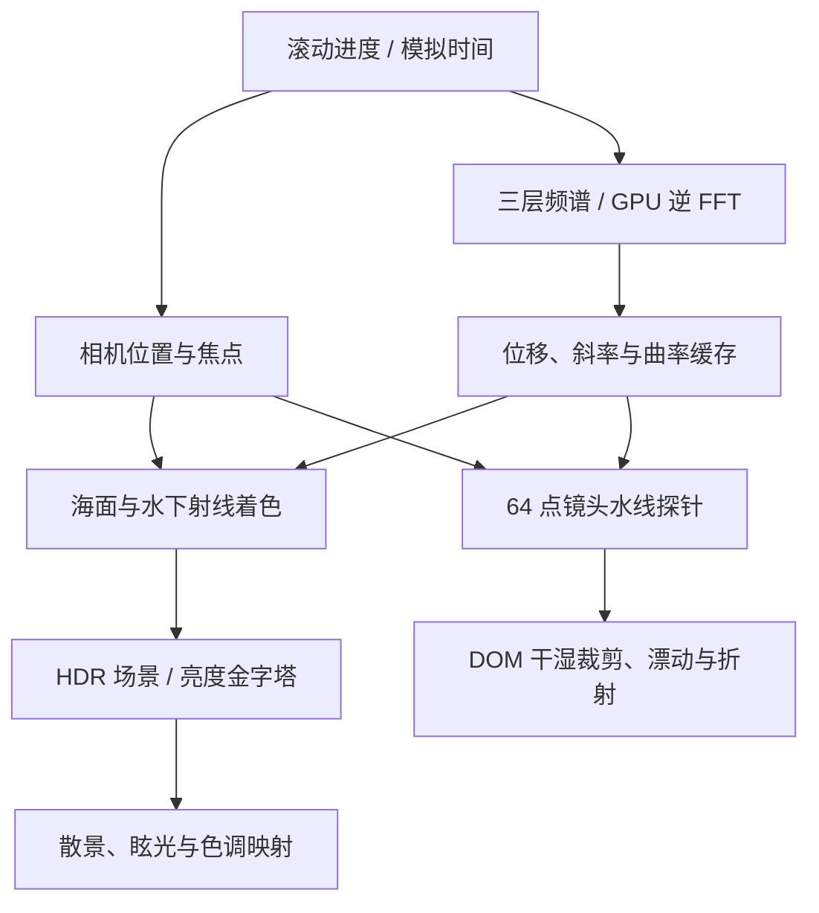

# Ocean Below the Surface

一个使用 React、Three.js 与 WebGL2 实现的实时海洋网页。滚动两屏高度的页面，镜头从海面上方经过半浸没状态，最终下潜到水下；海浪、镜头水线和界面漂动共享同一波场。

[在线演示](https://snychng.github.io/ocean-below-the-surface/)

## 效果

- 首屏约三分之二天空、三分之一海洋，保留贴近海面的摄影构图。
- 镜头保持水平，仅随滚动竖直下潜；穿越水面时轻微跟随局部涌浪。
- 实时波峰、天空反射、太阳碎光、近景散景，以及水下吸收、光束和悬浮颗粒。
- 半浸没时根据球面镜头罩与波面的交线区分空气和水下，叠加薄水膜与细碎泡沫。
- 标题在实际水线处切换干湿外观，浸水组件随波场漂动并产生轻微折射变形。

海洋由实时着色器绘制；天空使用本地 JPG 环境素材，页面没有后端、账户或 API Key 依赖。

## 技术栈与运行要求

| 用途 | 实现 |
| --- | --- |
| 页面与交互 | React / React DOM 19.3.0 |
| GPU 渲染 | Three.js 0.185.1、WebGL2、自定义 GLSL |
| 开发与构建 | Vite 8.3.0、React 插件 6.1.1 |
| 浏览器验证 | Playwright 1.58.2 |
| 单元测试 | Node.js 内置 `node:test` |

Node.js 要求为 `^20.19.0 || >=22.12.0`；可使用 Node.js 22.12 或更高版本。浏览器需要 WebGL2 与 `EXT_color_buffer_float`；浮点线性过滤可用时使用 Float32 波场，否则回退到 HalfFloat。

字体使用系统 Didot、Bodoni MT、Times New Roman 等回退链，不同系统的文字宽度可能略有差别。

## 本地运行

```bash
git clone https://github.com/snychng/ocean-below-the-surface.git
cd ocean-below-the-surface
npm ci
npm run dev
```

打开 [http://localhost:4188/](http://localhost:4188/)。开发服务绑定 `0.0.0.0`，使用固定端口 4188；端口被占用时会直接报错。

```bash
npm test
npm run build
npm run preview
```

`build` 输出到 `dist/`；`preview` 用于检查本地产物，不是开发服务。它也使用 4188 端口，启动前请停止正在运行的 `dev`。

## 操作与调试

- 滚轮、触控滚动：连续下潜或上浮。
- 顶部导航、主按钮和底部箭头：到达海面或水下；下潜到底后主按钮可返回。
- 左下角按钮：暂停／恢复海浪；页面主体获得键盘输入时也可按空格切换。
- 系统启用“减少动态效果”时默认暂停，取消 DOM 漂动和滤镜；点击 Play 可主动恢复海洋动画。

查询参数可以组合，例如 `?p=0.5&time=12&paused=1`：

| 参数 | 行为 |
| --- | --- |
| `p=0`、`p=0.5`、`p=1` | 固定海面、半浸没、水下进度；有效范围 0～1 |
| `time=12` | 设置初始模拟时间，单位为秒；默认 12 |
| `paused=1` | 初始暂停；暂停时仍可通过滚动改变镜头位置 |
| `quality=high` | 提高渲染像素预算，并关闭运行中的自动降分辨率 |

指定 `p` 后，页面滚动不再控制镜头。删除此参数并刷新，或在控制台执行 `window.__ocean.setProgress(null)`，可恢复滚动控制。

调试对象在渲染器初始化后可用：

```js
window.__ocean.state                 // 进度、时间、水线、分辨率、错误等
window.__ocean.setPaused(true)
window.__ocean.renderAt(0.5, 12)      // 固定进度和时间，同步读回水线
window.__ocean.setTime(20)
window.__ocean.setProgress(null)     // 恢复真实滚动
```

调试 API 直接控制渲染器，不同步 React 播放按钮状态；检查用户交互时应使用页面上的按钮。

## 渲染流程



**波场。** 基于有方向性的 Phillips 风浪谱，以 `ω² = g|k|` 推进深水重力波，在 GPU 上执行逆 FFT，得到高度与水平位移。当前组合长浪、细浪和微波纹三层：64m / 512²、8m / 256²、2m / 128²。斜率缓存的 mip 与未解析方差用于抑制远景闪烁。

**光学。** 海面与水下从同一位移场求交，使用 Fresnel、Snell 折射、全反射和微表面近似。水中路径使用吸收与散射，波面曲率参与光束聚焦；HDR 后处理负责亮部眩光及随深度变化的散景。

**镜头与 UI。** 世界太阳方向保持固定，相机从约 0.58m 下降到 −3m。球面镜头罩定义半浸没边界；64 点 GPU 探针通常异步读回，驱动互补的 DOM 多边形裁剪。湿态文字使用 SVG 位移滤镜和 CSS transform，动画更新通过 ref 写入，避免每帧重渲染 React 树。

## 重要文件

| 文件 | 职责 |
| --- | --- |
| `src/App.jsx`、`src/styles.css` | 页面布局、按钮、无障碍语义和干湿界面 |
| `src/components/OceanCanvas.jsx` | 异步加载渲染器、React 生命周期与暂停状态 |
| `src/ocean/OceanRenderer.js` | 渲染通道、资源管理、探针回读和分辨率调节 |
| `src/ocean/spectrum.js`、`WaveSimulation.js` | 频谱构造、CPU 参考计算和 GPU FFT |
| `src/ocean/camera.js` | 相机路径、固定太阳方向、焦点和光学辅助函数 |
| `src/ocean/shared.glsl`、`surface.frag.glsl`、`curvature.frag.glsl` | 波面查询及缓存 |
| `src/ocean/ocean.frag.glsl`、`waterline.glsl` | 海面、水下、光束、水膜和泡沫 |
| `src/ocean/probe.frag.glsl` | 镜头水线与界面漂动数据 |
| `src/ocean/bright.frag.glsl`、`post.frag.glsl` | HDR 亮部提取、散景和最终显示 |
| `public/environment/sky-panorama.jpg` | 运行时使用的天空环境素材 |
| `tests/`、`scripts/` | 数值测试、GPU 回归、截图与视频采样工具 |

## 物理近似与性能边界

这是带有物理模型的实时视觉原型，使用周期频谱高度场，没有求解完整 Navier–Stokes 流体、翻卷碎浪、泡沫输运或物体浮力。泡沫、水膜、光束聚焦和 DOM 折射均包含程序化近似；天空不是完整的大气散射模拟。

`ocean.frag.glsl` 中的 **`distantSunGlow` 是明确的非物理构图处理**：水平镜头下，按 Snell 定律形成的太阳像会处于画面上沿之外，因此额外沿空气中的太阳方向叠加水下日光晕，使主亮区留在画面右侧。它与真实折射太阳光同时存在，不能解释为严格的单次散射结果。调整真实性与构图取舍时，应首先检查此函数。

默认渲染预算约 140 万像素；检测到持续较低的帧率后会降低内部渲染比例。`quality=high` 使用约 420 万像素预算，代价是更高的 GPU 占用。实际表现取决于显卡、分辨率、浏览器及录屏开销，本项目不承诺跨设备固定 FPS。

## 验证与录屏工具

`npm test` 运行 CPU 数值与光学测试，不需要浏览器。GPU 和交互验证需要先在一个终端执行 `npm run dev`，再在另一终端运行：

```bash
npm run verify:browser
node scripts/verify-wave-gpu.mjs
node scripts/verify-post-gpu.mjs
node scripts/capture-preview.mjs
node scripts/measure-underwater.mjs my-check 12,20,31
```

| 工具 | 检查内容与额外依赖 |
| --- | --- |
| `verify-browser.mjs` | 真实滚动、三种浸水状态、暂停、移动视口及 reduced-motion；`OCEAN_URL` 可指定页面地址 |
| `verify-wave-gpu.mjs` | GPU FFT 对照独立 CPU 逆 DFT；`OCEAN_BASE_URL` 可指定开发服务 |
| `verify-post-gpu.mjs` | 散景显式 LOD 的 GPU 回归；`OCEAN_BASE_URL` 可指定开发服务 |
| `capture-preview.mjs` | 固定模拟时间截取三状态；`OCEAN_CAPTURE_DIR` 可指定输出子目录 |
| `measure-underwater.mjs` | 测量水下光区与碎光；另需 PATH 中可用的 FFmpeg，输出目录必须为空 |

所有浏览器脚本使用系统 Google Chrome（`channel: 'chrome'`）。交互验证、预览截图和水下测量脚本还指定 ANGLE Metal，当前以 macOS 为运行环境；其他平台需调整该启动参数。两个 GPU 回归脚本直接导入开发服务的源码与 `node_modules`，不能针对 `preview` 或线上构建执行。

交互脚本包含 24 FPS 的本机验收断言，它是测试阈值，不是产品性能保证。移动检查是浏览器视口模拟，不代表真实手机验收。截图只能验证对应状态，不能替代动态检查。

确认效果后，可显式开启交互录屏：

```bash
OCEAN_RECORD=1 npm run verify:browser
```

默认验证不会录制视频；显式录制输出 WebM。截图、报告与录屏写入项目内被 Git 忽略的 `分析/` 目录。

`sample-recording.py` 可将完整录屏按真实 PTS 以 6 fps 采样，每 6 帧生成一张 3×2 拼图。需要 Python、Pillow、FFmpeg 和 ffprobe：

```bash
python3 -m venv .venv
. .venv/bin/activate
python -m pip install Pillow
python scripts/sample-recording.py recording.webm 分析/recording-check --ffmpeg ffmpeg --ffprobe ffprobe
```

采样器默认工具及中文标签字体选择针对 macOS；上面的参数改为通过 PATH 查找 FFmpeg，其他系统仍需调整脚本中的字体选择。输出目录须为空，采样结果会记录执行路径，不应作为公开源码一并提交。

## GitHub Pages 部署

部署入口为 [`.github/workflows/pages.yml`](.github/workflows/pages.yml)。当前默认分支是 `feature/20260924/YuchengSun/publish-ocean`，不是 `main`。

- Pull request 执行依赖安装、`npm test` 和生产构建；不会运行依赖本地 GPU 的浏览器测试。
- 合并到默认分支后，工作流构建并部署 `dist/` 到 GitHub Pages。
- 构建命令使用 `npm run build -- --base=/ocean-below-the-surface/`，匹配项目站点子路径。
- 天空资源地址跟随 `import.meta.env.BASE_URL`，避免在子路径部署时错误请求域名根目录。

复用仓库部署到自己的 Pages 时，在仓库 Settings → Pages 中选择 GitHub Actions。工作流通过 `github.event.repository.name` 自动生成 `--base`，fork 或修改仓库名无需手动调整；部署到域名根目录时将 `--base` 改为 `/`。如果更换默认分支，还需同步修改工作流的分支过滤条件。

参考：[Vite 静态部署指南](https://vite.dev/guide/static-deploy.html#github-pages)、[GitHub Pages 自定义工作流](https://docs.github.com/en/pages/getting-started-with-github-pages/using-custom-workflows-with-github-pages)。
